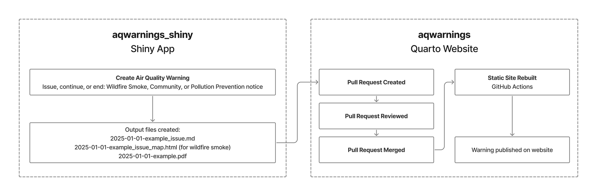

# Releasing and Updating Warnings

## Creating a Warning

### Process Overview

1. This repository, `aqwarnings` comprises a Quarto application that will collate and render documents in
   Markdown format, producing a complete website with navigation and several automatically-generated lists (for example,
   current Air Quality Warnings - Wildfire Smoke, and historical warnings).
2. The resulting website is published on [Github pages](https://bcgov.github.io/aqwarnings/). It is a static
   website, and must be rebuilt from scratch each time content changes. It must also be rebuilt to recompute lists (for
   example, those that rely on dates, like the
   list of active warnings). It should ideally be rebuilt daily to remain current.
3. To contribute a new Air Quality Warning, use the companion Shiny application. This application will
   produce three output files when run. Those three files should be submitted to this repository in the form of a
   pull request (PR). Once a PR is opened, you can "preview" the changes from the PR Preview Action link that 
   appears as a comment in the PR.
4. When the pull request is merged, the site will begin to rebuild. You can view the status of the build process
   in [Github Actions](https://github.com/bcgov/aqwarnings/actions). Once the action completes, the new
   content will be available on the public [Github pages](https://bcgov.github.io/aqwarnings/) site
   immediately.

### Pull Request Details

- The pull request should be created against the `main` branch. This can be accomplished by either checking out the
  repository locally and making changes with the `git` command line or desktop tools, or via Github's web interface
  using the [upload tool](https://github.com/bcgov/aqwarnings/upload/main).
- Regardless of the method for creating the pull request, it should include these files:
  - dated markdown file (eg `2025-02-06_wildfire_smoke_issue.md`)
  - corresponding PDF file (eg `2025-02-06_wildfire_smoke_issue.pdf`)
    - map of the regions effected (eg `2025-02-06_wildfire_smoke_issue_map.html`) - only for Wildfire Smoke warnings
- The files should be added to the project in the directory `frontend/warnings/`.
- If more than one warning is created on a given day, consider creating them with a meaninful
  name, such as the region or the hour of issue.

## Updating or Removing a Warning

### Updating an existing Warning

To update an existing warning, follow the same steps as above to regenerate the warning and create a pull request 
against the `main` branch that **overwrites** the files you wish to edit. After the pull request is merged and the 
site rebuilt, the content will be updated.

You may also create a pull request manually with the Github website if you wish to manually update specific wording
within a warning, current or historic. Be aware that you can only edit the generated `html` content this way, and
that corresponding `pdf`s are passed through unmodified (so if you need to change a PDF too, you must regenerate the 
warning in the Shiny app before exporting it),

### Removing a Warning

To remove a warning, create a pull request against the `main` branch that deletes the files (markdown, pdf,
and for Wildfire Smoke warnins, the `map.html`). When the site is rebuilt, the content will be removed and will 
not be accessible via any listings or directly by the URL.
