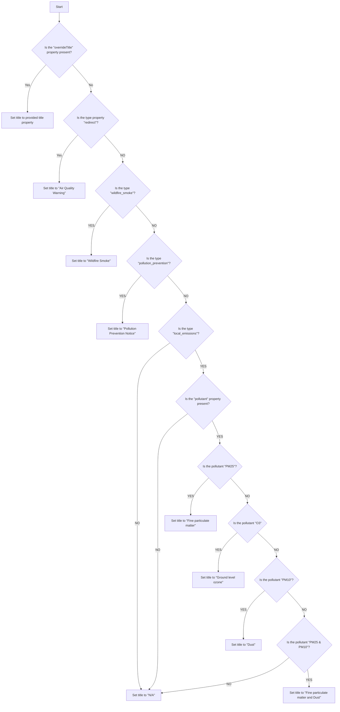
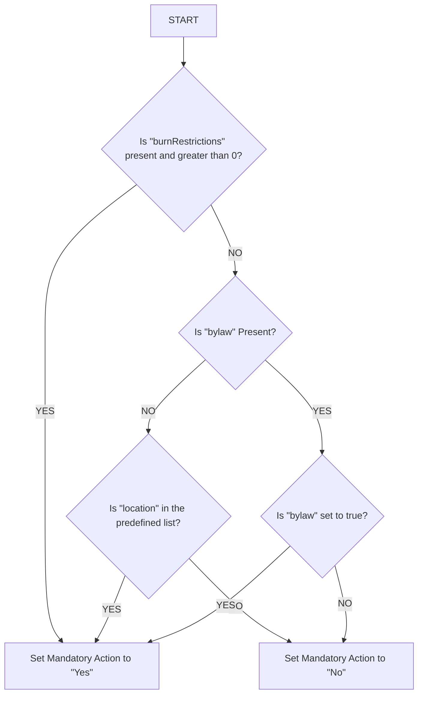

# Warning Display Logic

For display, automatic titling, and automatic mandatory action generation on the
recent warnings list, the following minimal properties must be present in the
YAML header or YAML file for the warning:

```yaml
date: ISO8601 date
ice: string - "ISSUE", "CONTINUE", or "END"
location: string
type: string - "redirect", "wildfire_smoke", "pollution_prevention", or "local_emissions"
```

In addition, the following properties are optional:

```yaml
path: string - Required only if the type is "redirect".
overrideTitle: - boolean - If true, use the provided title property
title: string - Required only if overrideTitle is present and set to true.
bylaw: boolean - If present and true, Mandatory action will be "Yes". If present and false Mandatory Action will be "No"
burnRestrictions: integer - if present and greater than 0, Mandatory Action will be "Yes". Takes precedence over bylaw property.
pollutant: string - Required only if the type is "local_emissions". "PM25", "O3", "PM10", or "PM25 & PM10"
```

The following locations will have "Mandatory Action" set to "Yes" unless
overridden by `bylaw: false`:

- Burns Lake
- Duncan
- Houston
- Prince George
- Smithers
- Valemount

## Selecting the Title



## Selecting Mandatory Action


