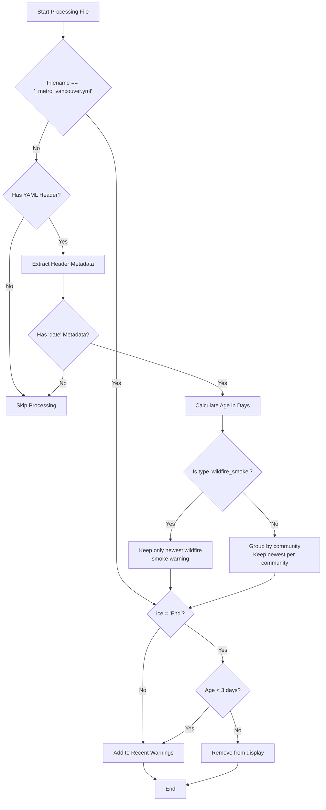

# Front Page Selection Logic

This document outlines how warnings are selected for inclusion on the front page as part of site rendering.

## Overview

The [script](https://github.com/bcgov/aqwarnings/blob/main/frontend/construct_lists.py) processes input files from Quarto's project input files and categorizes them to identify recent warnings:

**Recent Warnings**: Warnings issued within the past 5 days (configurable via `RECENT_THRESHOLD_DAYS`), with special handling for wildfire smoke warnings.

## Business Description

The script:
1. Reads input files from `QUARTO_PROJECT_INPUT_FILES` environment variable
2. Extracts YAML headers using regex
3. Applies the selection logic
4. Outputs a YAML file:
   - `_recent_warnings.yaml` for recent warnings

This output file is then used in custom listings within the Quarto site.

## Selection Flowchart

## Selection Logic Details

### For Any Warning

1. Special handling for Metro Vancouver: if the filename is `_metro_vancouver.yml`, it is directed immediately to the status (ice) check. If ice = "End", it's only shown if less than 3 days old.
2. All files are processed if they have a valid YAML header.
3. Essential metadata is extracted (path, title, type, ice, date, location).
4. Regular warning files are considered for the Recent Warnings list if they have a date.

### For Recent Warnings

1. Warnings are grouped and filtered:
   - For wildfire smoke warnings: only the most recent warning is kept
   - For non-wildfire warnings: warnings are grouped by community and only the most recent warning per community is kept
2. Special handling for warnings with "End" status:
   - If a warning has ice = "End", it's only shown if it's less than 3 days old
   - Otherwise, it's removed from display
3. All other warnings are added to the Recent Warnings list
